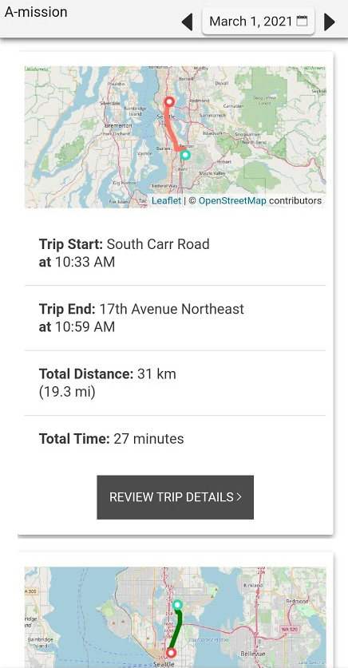

## A-Mission: Accessible Trip Diary App

### Project Participants
- Bowen Xu: University of Washington Computer Science
- Maryam Saleh: University of Washington Computer Science
- Asila Maksumova: University of Washington Computer Science
- Josh Curtis: University of Washington Computer Science
- Bruce Visser: Needs Expert, Adventurous traveller

### Project Abstract

This quarter, our team worked on improving E-mission, which is an existing open-source mobile app that provides a trip diary so users can see which trips they’ve taken and which modes of transportation those trips involve. Our team identified E-mission as a useful app for people with disabilities, especially those who might typically have to spend longer planning and carrying out their daily travel due to inaccessible routes and lack of accomodation. The only problem is that the original E-mission app was not designed with accessibility in mind, rendering it essentially useless for users with visual impairments who rely on screen readers or braille readers. One such user is our Needs Expert, Bruce Visser, who uses a braille reader to navigate his phone. One of the main goals of this project was to improve the app's accessibility in order allow people like Bruce to utilize _all_ of the functionality that E-mission's trip diary has to offer. We hope that our improved E-mission app could be used by people with disabilities to keep track of the trips they take and identify any inaccessible parts so they can have an easier time planning for their future trips. 

_A note about terminology:_ In the context of this project, “trip segmentation” refers to the way that E-mission splits up each trip into segments. Each segment involves one single mode of transportation, like walking or riding a bus. A new segment begins when the user switches to a different mode of transportation.

### Project Goals

#### Improve E-Mission accessibility
The original E-mission app was not particularly accessible. In fact, a lot of the trip diary's functionality depended on the user being able to look at a map for each trip. Since map widgets are notoriously difficult to navigate via screen reader, this dependency caused visually impaired users to be excluded.

It's important to our team that E-mission's trip diary is totally accessible to anybody and everybody, so we made it our main goal to improve the trip diary's overall accessibility and bring it up to par with the most recent Web Content Accessibility Guidelines. Much of our work on this goal involved updating the app's design in order to streamline the screen reader’s navigation of the trip diary screens. There were a lot of "basic" accessibility improvements for us to make as well, including adding alt text for buttons, hiding decorative content from the screen reader, and increasing button size and text color contrast to meet current accessibility standards.

Below is an example of how the Trip Diary page looks before and after our accessibility improvements.

_Before (the original E-mission Trip Diary):_


_After (our improved A-mission Trip Diary):_




#### Improve the motion prediction model and update it to be inclusive of people who use wheelchairs

The original E-mission app uses a pre-trained motion classification model in order to segment trips and determine which mode of transportation was used for each segment. Unfortunately, the model was given little or no wheelchair data, causing E-mission's trip diary to exclude users whose trips involve travel via wheelchair. The less accurate the model is, the less useful E-mission becomes, so we made it a goal to improve the motion prediction model and update it to be inclusive of people who use wheelchairs.

Part of this goal involved evaluating the accuracy of the original E-mission model. To do this, we designed pre-defined trips that cover various modes of transportation, such as walk, car, train, etc. To cover as many cases as possible, we also designed pre-defined trips that mix different transportation modes and have various time durations. Our team carried out these trips and recorded the data to be analyzed later. During our data collection process, we also collected additional data using an Integrated Motion Unit (IMU) plugin. These additional data points are directly collected from the phone's accelerometer and gyroscope. This data should help correct inaccuracies in the current E-mission models.

At the beginning of the project, we had hoped that part of this goal would involve training a new, more accurate motion prediction model. We ended up writing a data analysis script instead that fetches E-mission data and matches it with the IMU data for each trip segment. If the user uses our UI to update the mode of transportation for a trip segment, this data will be matched as well. Due to time limitations, we weren’t able to train a new motion inference model. However, our data analysis script is a firm step toward the full integration of IMU data so that future projects can build upon our work. 

### Project Development
#### Accessibility improvements and other front-end work
When we started planning out our accessibility improvements at the beginning of the quarter, we quickly realized that we would need a new UI design that allows for better screen reader navigation than the original E-mission app. We used Figma to sketch out some preliminary designs and worked together to come up with a final cohesive design after a few iterations. During this process, we focused on three screens in particular: the main "Trip Diary" page, the trip review page that allows users to review the details of a particular trip, and the "Edit Mode of Transportation" page. Our main goal here was to end up with a design that had a straightforward layout, large, easy-to-read text and buttons, and no extraneous information. The most important requirement was that we needed our users to be able to review the details of any trip (and update them if necessary) quickly, easily, and with no reliance on the map widget. Below is a screenshot of our final design that we made in Figma.


Although our improved E-mission app mostly reflects the designs above, we did have to make some changes after we started developing. The most obvious example of this is the dropdown "Trip Segments" list that we included on the trip review page. After talking with Bruce and getting feedback from the course staff, we quickly realized that putting the segments in a dropdown list (as opposed to a regular list that is always present on the screen) would require unnecessary input from the user and may even result in focusing issues with the screen reader. To fix this, we scrapped the dropdown list idea and put the trip segments in a list that is visible to the user at all times.

All of our accessibility improvements were accomplished by using HTML, CSS, and the JavaScript-based Angular framework. For our front-end work, we edited the existing E-mission codebase using WebStorm. To debug and test our application, we used the debug feature in Android Studio and ran the app on either a physical Android phone or an emulator (both of which allow use of a screen reader). For accessibility testing in particular, one tool we found useful was Android's Accessibility Scanner app. The Accessibility Scanner does not find _every_ accessibility issue, but it does a good job of finding things like low color contrast, touch targets that are too small, and elements without alt text. Below is a screenshot showing all the issues (highlighted in orange) that the Accessibility Scanner identified on just one portion of the trip review screen before we started our accessibility improvements.


#### Pre-defined trips
In order to evaluate the accuracy of E-mission's motion prediction model, we defined some trips involving various modes of transportation that we then carried out as if we were regular E-mission users. We consider the data collected from these trips to be "ground truth," since we already know what the modes and segmentation of these trips _should_ be. The purpose of using pre-defined trips instead of actual user data was to avoid potential user privacy concerns. Given the sensitive nature of location tracking, we did not want to put users in an uncomfortable position by asking them to share their trip data.

The image below shows the Google Doc where we defined five different trips. You can see that we broke down each trip into the segments that the motion prediction model should, ideally, identify.


#### Integrated Motion Unit (IMU) plugin modernization and integration
The original [IMU plugin](https://github.com/xubowenhaoren/e-mission-integrity-detect) was developed 3 years ago. When we first attempted to add the plugin to our project, we found that Cordova no longer recognizes the plugin. Upon further research, we learned that all recent plugins require a ```package.json``` as the plugin describer. We consulted existing E-mission plugin repos and added the ```package.json``` to modernize the IMU plugin.

#### Data Analysis and Motion Prediction Model Improvement

In the A-mission project, we collected one complete round of the data. We ran the E-mission analysis pipelines with the most accurate model (`gis-based-mode-detection`). We then performed a comparison of the E-mission motion inference with actual pre-defined trips. We determined that it still generates inaccurate trip segmentation and motion mode sensing for even common motion modes. 

- See our full comparison here: `documentation/data_comparison.md`. ([link](https://github.com/CSE482Winter2021/NameN0tF0und/blob/main/documentation/data_comparison.md))

Under Prof. Caspi's guidance, we successfully developed a data analysis script that can match and merge the E-mission data and IMU data on a segment level. Its highlight features include: 

- Connects to an instance of the e-mission server
- Accepts a user UUID (e.g. email) and use it to fetch all processed trip data
- For each trip segment, fetch all corresponding IMU data from the SQLite phone UserCache local database
- Also for each trip segment, check and fetch user input ground truth from the UserCache.

Any future analysis pipeline can directly use our data analysis script, benefit from its data merging features, and kick-start the ML development work. 

### Constraints and Limitations

#### UI Accessibility

As an open-source project since 2015, E-mission is a complex platform with a hybrid mobile application architecture. It has too many UI tabs and features for our small team to redesign and meet the accessibility standards. Therefore, in the beginning of the project, we've identified that the trip diary UI offers the essential functionalities of E-mission. We then dedicated our focus to improve the UI accessibility of the trip dairy UI as much as possible. With this said, there are still design compromises caused by the architecture, such as the navigation bar and the date picker. (Please see the "Things to improve" section for the in-depth discussion.) 

#### Data Analysis and Motion Prediction Model Improvement

Data collection: Initially we planned to use the E-mission server hosted on Prof. Caspi's research lab. However, after several unsuccessful trials to upload the data and run the server-side analysis pipelines, we had to build our own instance of E-mission server from scratch. 

Data analysis: Before we collected the trip data, we built our E-mission server with the best motion inference model option. However, we realized later that to perform a quantitative analysis on the E-mission prediction, we need to set up the E-mission server with another special branch (MobilityNet). The data we collected is unfortunately incompatible with the MobilityNet data analysis scripts. Nevertheless, earlier in the project we collectively decided that we will prioritize the work on improving the accessibility of the E-mission UI, especially the trip diary UI. Thus we had limited time and resources on the data analysis subproject. Our team has then immediately opened up a discussion, actively communicated with Prof. Caspi, and constructed alternative plans.

### Preliminary, Anecdotal Experimental results

#### Positive Notes

1. Users can now change the predicted mode of transportation if it’s not accurate.
   - This can be done by clicking a button on the segment that you want to change, which will bring you to a new page where you can select from a list of modes.
   - Our needs expert recommended we either use a popup for this functionality or a totally new page altogether, so we opted for a new page because it works more smoothly with TalkBack.

2. Users can now learn about his/her daily trips with more details. 
   - Users can now review their past trips and learn about the details of these trips and their individual segments by using a screen reader or a braille reader exclusively. 

3. Our app accommodates diverse use.
   - Our improved E-mission app will likely be the most useful for people with motion-related disabilities, but it’s now usable by people with visual impairments as well. 
   - Users with visual and auditory impairments, like our needs expert, can interact with the improved E-mission app by using a braille reader too.

#### Things to improve

1. The date picker button and calendar are not accessible. Two participants noted the lack of a descriptive label for the date picker button.
   - Feedback: we've since then introduced alt text labels for the previous/next day buttons, and for the date picker button. However, the E-mission date picker popup is a third party plugin. This makes updating the screenreader focus very difficult. Therefore, future developers should consider looking for accessible date picker replacements. 
2. The navigation bar (at the bottom of the app screen) is not very accessible. When using the screen reader, we noticed that icons do not have alt texts. For each tab, the icon and the tab name was also focused twice by the screenreader. 
   - Feedback: we noticed that the cause of the screenreader double-focus is the lack of alt texts. While we were able to pinpoint the source code for  the navigation bar, we also noticed that it's written in Ionic, a hybrid UI framework, instead of standard HTML. As a result, we weren't about to directly fix the layout to address the double-focus issue. However, during the development of A-mission, we found that the other tabs do not have any functionality that relates to the trip diary feature. In other words, the trip diary UI represents the core functionality of E-mission (A-mission). Thus we removed the icons and hid other irrelevant tabs. 
     - As a result, the user can quickly use the screenreader to focus on the actual trip/segment information. See an example in the demo video: `documentation/demo_video.mp4` ([link](https://github.com/CSE482Winter2021/NameN0tF0und/raw/main/documentation/demo_video.mp4))
3. Some of the default buttons like “refresh” and “fix map” buttons are confusing. 
   - Feedback: We've removed these unnecessary buttons in the final version of A-mission.
4. Navigating between trip cards is laborious. There is not an easy way to jump from one to the next without navigating through all of the information displayed on the trip card. 
   - Feedback: Theoretical fixes that make the trip cards skippable exist. One example is the use of `h3` tags to the header elements of every trip card. While we've made attempts to achieve this fix, we couldn't generate a stable feature for this due to the time constraints. 

### Conclusion and Future Directions

#### Conclusion

Through the complete UI redesign, the A-mission project has enabled high accessibility for the E-mission trip diary UI and high usability for people with screen readers. Moreover, we believe that through reviewing the trip summaries and the segmentation details, our A-mission app can help people with both vision and motion disabilities to travel with more confidence. They can how easily know which part of their trip takes the most time and make informed decisions about future travel. 

Through the integration of the Integrated Motion Unit (IMU) plugin and the introduction of the accessible segmentation motion mode editing UI, we enabled the collection of "ground truth" user input. The "ground truth" refers to the actual motion mode compared to the E-mission predictions. 

Through the development of the data analysis script, we can match and merge the E-mission data and IMU data on a segment level.  This data analysis script sets a firm foundation toward the full integration of IMU data into an improved E-mission motion inference model. 

#### Future Directions

On the A-mission UI, one next step is to make the E-mission app fully accessible, including the user registration and other tabs in E-mission. Another area of improvement is advanced on-device data analysis. 

- This future A-mission app will analyze each user trip over time and decide what trips belong to this user's routine. 
  - This can be done by grouping trips by the same start/end locations. 
- After that, the A-mission app can compare a routine trip to previous routine trips and automatically deduce whether this trip took shorter or longer than usual. For instance, an example notification of this future A-mission app can be "This daily commute took 26% longer than usual." This helps the user evaluate the transportation accessibility more easily. 

On the data analysis, one next step is to train a new machine learning (ML) model that reads both E-mission and IMU data and provide better motion inference predictions. 

- E-mission's MobilityNet project introduced a method to qualitatively evaluate the current E-mission motion inference model. See my notes on the project [here](https://github.com/CSE482Winter2021/NameN0tF0und/blob/main/documentation/data_analysis.md#partial-notes-on-running-a-new-mobilitynet-data-collection-project). 

### User Manual

- Installing the App
  - Find the pre-built APK in `documentation/apk_release/app-debug.apk`. [Download link](https://github.com/CSE482Winter2021/NameN0tF0und/raw/main/documentation/apk_release/app-debug.apk)
  - If Android warns you about “installation from unknown source”, ignore that.
  - If you use the emulator, you can open the Files app, drag & drop the APK to install. 
  - If you use the phone, follow this guide to copy the APK to your phone: https://www.lifewire.com/install-apk-on-android-4177185 

- Registering the App: See `documentation/user_manual/register_app.md`  ([link](https://github.com/CSE482Winter2021/NameN0tF0und/blob/main/documentation/user_manual/register_app.md))

- Logging Trips
  - Be sure you turn on your Wi-Fi or a mobile data plan. Also, make sure that your GPS is on. Do not force-kill the app. It will stay in the background but won’t consume much battery. 
  - You now have two choices to record a trip. The recommended way is to go out and take a walk in your neighborhood. The app will automatically start recording the trip. 
  - Another way is to manually trigger it and log a mocked trip.  See `documentation/mocking_trips.md`. ([link](https://github.com/CSE482Winter2021/NameN0tF0und/blob/main/documentation/mocking_trips.md))

- Viewing trips, trip segments, and editing the segmentation motion mode: See `documentation/user_manual/viewing_trips.md` ([link](https://github.com/CSE482Winter2021/NameN0tF0und/blob/main/documentation/user_manual/viewing_trips.md))

### Developer Documentation

- For building and running the A-mission app from source code, with or without a physical Android phone, see `documentation/building_and_running_a_mission_app.md` ([link](https://github.com/CSE482Winter2021/NameN0tF0und/blob/main/documentation/building_and_running_a_mission_app.md)). 
- For mocking trips to test the trip diary UI without physically doing trips, see `documentation/mocking_trips.md`. ([link](https://github.com/CSE482Winter2021/NameN0tF0und/blob/main/documentation/mocking_trips.md))
- For obtaining a full backup of the A-mission app from one phone and restoring the backup to a different phone, see `documentation/obtain_full_backup.md`. ([link](https://github.com/CSE482Winter2021/NameN0tF0und/blob/main/documentation/obtain_full_backup.md)) This is extremely helpful when the developing team uses multiple phones and the data collection phone is different from the phone used for app development purposes. 
- For setting up breakpoints and debugging in the JavaScript UI, see `documentation/chrome_inspect.md`. ([link](https://github.com/CSE482Winter2021/NameN0tF0und/blob/main/documentation/chrome_inspect.md))
- Data analysis: To match and merge the E-mission data and IMU data on a segment level, see  `documentation/data_analysis.md`. ([link](https://github.com/CSE482Winter2021/NameN0tF0und/blob/main/documentation/data_analysis.md))

### Special Recognitions

- Special thanks to Prof. Anat Caspi and Motoya Ohnishi for project mentorship!
- Special thanks to K. Shankari for creating the original [E-mission app](https://github.com/e-mission/e-mission-phone/) and suggestions! 
- Special thanks to Bruce Visser for providing detailed insights regarding travel and mobile app accessibility!

