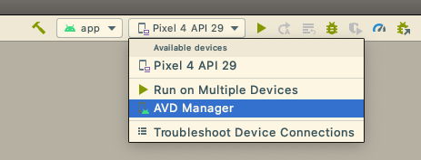

### Building and Running A-mission app

Bowen Xu

This documentation assumes that you are using macOS. With that said, the majority of the steps will be the same or similar if you are using a Linux-based system. 

1. Pull the code. 
2. In Terminal, run `curl -s "https://get.sdkman.io" | bash` to install sdkman. (Skip this step if your Java environment is already Java 8)
3. Run `sdk install java 8.282.08.1-amzn` to download Java 8. Note this is for the sdkman virtual environment. It doesn’t break any of your existing java setup.  (Skip this step if your Java environment is already Java 8)

4. Run the following commands. Note that after you run the first command (`source setup/setup_android_native.sh`), you should see “All plugins installed successfully!” If not, the setup script has probably failed mid-way. You can simply run the same command again.
   - If you wish to use a new E-mission server and need to change the server url, update `connectUrl` in `www/json/connectionConfig.json` before running the script below. ([link](https://github.com/xubowenhaoren/A-Mission/blob/main/www/json/connectionConfig.json#L2)). 
     - Also note that the [official guide](https://github.com/e-mission/e-mission-docker#quick-start-installation-instructions) to installing the E-mission server is not exactly clear. See this [related issue](https://github.com/e-mission/e-mission-docs/issues/619#issuecomment-783986767) for more details. 

```bash
source setup/setup_android_native.sh
npx cordova plugin add cordova-plugin-cleartext
cd ../
git clone https://github.com/xubowenhaoren/e-mission-integrity-detect.git
cd NameN0tF0und
npx cordova plugin add file:../e-mission-integrity-detect
sdk use java 8.282.08.1-amzn
npx cordova build android
```

5. Get Android SDK setup here: https://developer.android.com/about/versions/11/setup-sdk 
   - Check this post if you have issues with `$ANDROID_HOME`. Start reading from “3. If the SDK was installed automatically as part of Android Studio then it's located here.” https://stackoverflow.com/questions/19986214/setting-android-home-enviromental-variable-on-mac-os-x 
6. Install gradle if you still have issues with step 5: `sdk install gradle 6.8.1`

7. Open Android Studio -> Open an Existing Project.
   

8. In the popup window, open `YOUR_CODE_LOCATION/platforms/android`. 
   
9. If you have an Android phone and want to use it for testing, connect your Android phone to your mac. Use the Debug button to debug. 
   

10. If you don’t have an Android phone, follow the screenshots to add an emulator. First, find the AVD Manager.
    

    
    Select Pixel 4. 

    

    Select Android Q. 

    

     Click “Next”, then “Finish”. 

11. Finally, go back to "If you have an Android phone" and click “Debug” as if you have an Android phone. 


### Resetting your local workspace

You need to reset your workspace when:

- You discover strange setup issues
- You discover strange build issues
- Your team member pushed new code with important plugin changes

Run the following commands in the project folder. Note that after you run the first command (`source setup/setup_android_native.sh`), you should see “All plugins installed successfully!” If not, the setup script has probably failed mid-way. You can simply run the same command again.

```bash
git pull
rm -rf plugins
rm -rf platforms
source setup/setup_android_native.sh
npx cordova plugin add cordova-plugin-cleartext
cd ../
git clone https://github.com/xubowenhaoren/e-mission-integrity-detect.git
cd NameN0tF0und
npx cordova plugin add file:../e-mission-integrity-detect
sdk use java 8.282.08.1-amzn
npx cordova build android
```

