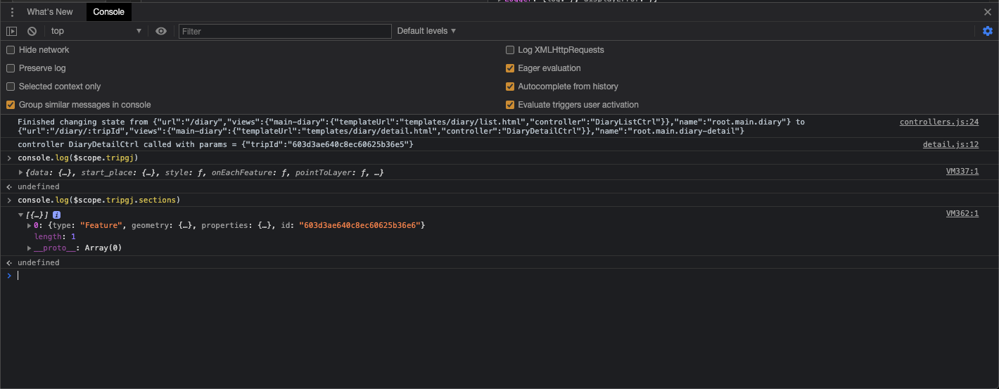

### Setting up debuggers and debugging in Javascript UI

Bowen Xu

This documentation is for setting up breakpoints and debugging in the JavaScript UI.

1. Open Chrome. Go to `chrome://inspect/#devices`

2. Open the E-mission app in your phone/emulator. 
   - If you use your phone to test the E-mission app, then connect your phone to your computer. 
3. Click "inspect".
   

4. In the inspect window, open the sources tab on the top and the console tab on the bottom.

   

5. Set your breakpoint to any Javascript file. The example sets one at `js/diary/detail.js:71`.

6. When the breakpoint is caught, you can find the variables updated on the right. You can also use the Step in/out/over features like other IDE debuggers.
   

7. You can also use the console to interactively examine values. 
   