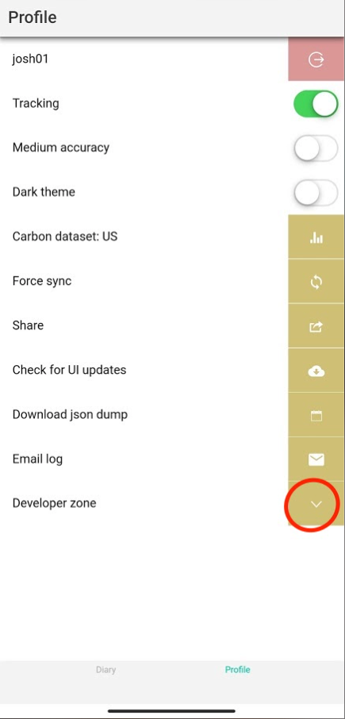
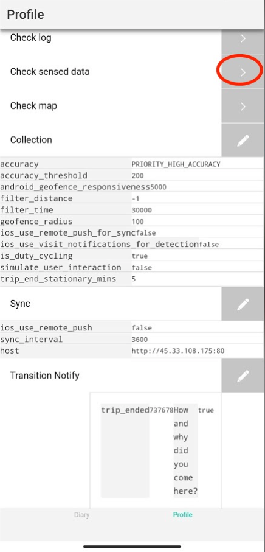
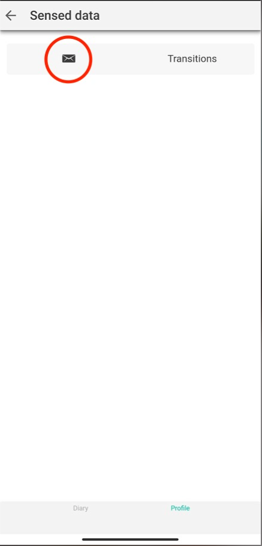
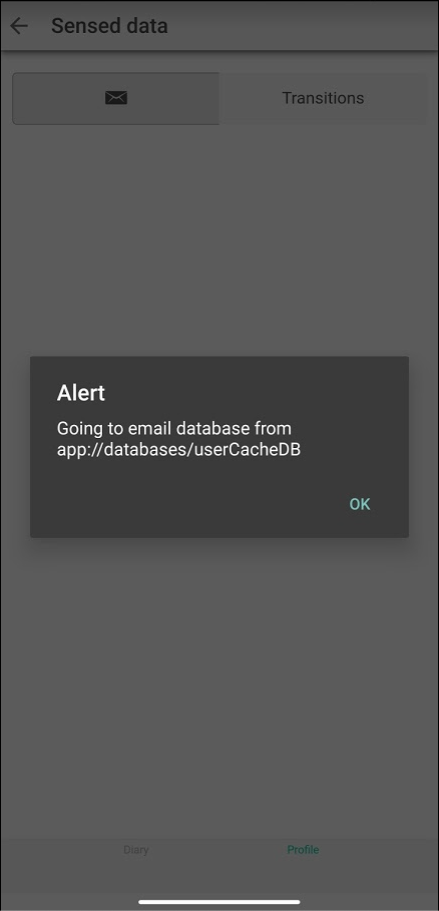

## Match and merge the E-mission data and IMU data on a segment level

Bowen Xu

This section provides all necessary information for using the A-mission data analysis script to merge the E-mission data and IMU data  on a segment level. 

#### Prerequisites

- Build the A-mission app. See `documentation/building_and_running_a_mission_app.md` ([link](https://github.com/xubowenhaoren/A-Mission/blob/main/documentation/building_and_running_a_mission_app.md)). 
  - The above documentation already includes the integration of the IMU plugin. If you are interested in changing the IMU plugin, the repo is at https://github.com/xubowenhaoren/e-mission-integrity-detect/.
- See the "Logging Trips" section of the user manual to log trips and collect the E-mission and IMU data. ([link](https://github.com/xubowenhaoren/A-Mission#user-manual)).
- Wait for the server-side analysis pipelines to process each trip. Before a trip is processed, the whole trip will appear as one segment and have the "unprocessed" motion mode. You wouldn't be able to view that trip in the data analysis script either. The trip processing speed depends on the phone-server connection and the server status. Both factors are beyond the scope and control of our project. 
  - You may change between days on the A-mission trip dairy UI to refresh.

#### Exporting the phone UserCache to obtain IMU data

Note: if you are just interested in viewing the IMU data and/or running the data analysis script, you can find an example userCache in `documentation/userCacheDB_with_IMU_data_and_user_input`. ([link](https://github.com/xubowenhaoren/A-Mission/blob/main/documentation/userCacheDB_with_IMU_data_and_user_input)). You can view the data contents with [SQLite Browser](https://sqlitebrowser.org/). 

The IMU data is stored locally in the phone UserCache. 

- Go to the E-mission (A-mission). Then switch to the Profiles tab. Click "Developer zone".
  
  
- Click "check sensed data".
  
- Click the email icon.
  
- In the alert popup, click "OK".
  
- Send the `userCacheDB` attachment as an email to yourself. 
  

#### Running the data analysis script to obtain merged data

- Download/fork the data analysis script here: https://github.com/xubowenhaoren/mobilitynet-analysis-scripts/blob/master/emeval/input/read_server_trip_and_IMU_data.ipynb
- Make sure your workspace has a working version of Jupyter Notebook.
- All comments regarding running the script are inline. 

## Partial notes on running a new MobilityNet data collection project

This section documents my observation in an attempt to run a new MobilityNet data collection project. 

The MobilityNet is a special branch of E-mission with a focus on model accuracy evaluation. 

Find the original paper and presentation PDF here: https://www.climatechange.ai/papers/iclr2020/15

- See the full discussion on the necessary steps for running MobilityNet analysis scripts: https://github.com/e-mission/e-mission-docs/issues/624
- See the full discussion on writing the evaluation spec: https://github.com/e-mission/e-mission-docs/issues/626
  - To use the Google Maps to quickly generate the evaluation spec, see this helper data analysis script: https://github.com/xubowenhaoren/mobilitynet-analysis-scripts/blob/master/spec_creation/generate_digital_pre_defined_trips.ipynb

