#### Mocking Trips

Bowen Xu

This doc is for mocking trips to test the UI trips without physically doing trips.

1. Build your copy of the E-mission app here, either on a phone or on an emulator: `documentation/building_and_running_a_mission_app.md` ([link](https://github.com/CSE482Winter2021/NameN0tF0und/blob/main/documentation/building_and_running_a_mission_app.md)). 

2. Install the Lockito location simulator app on your phone/emulator: https://play.google.com/store/apps/details?id=fr.dvilleneuve.lockito&hl=en_US&gl=US 
3. Open the Lockito app, agree to all the terms and conditions, and land on the main UI.
   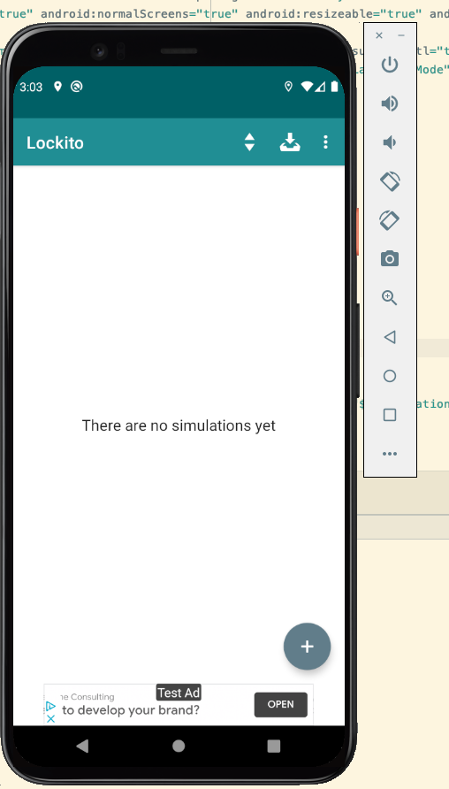
4. Turn on Developer Options. If you have a phone, look up online for how to do that, because different Android versions have slightly different “Settings” apps. 
   - If you have the emulator as configured in the `documentation/building_and_running_a_mission_app.md`, go to “Settings” -> scroll to the bottom and find “About emulated device” -> Click on the “Build number” 7 times -> Check for a floating text saying “You are now a developer!”.
     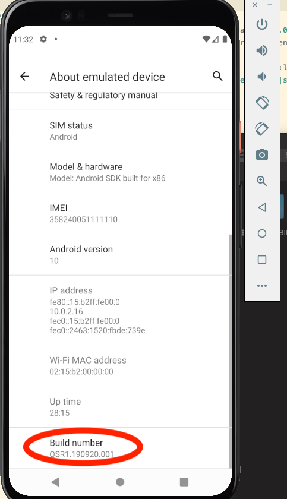
5. Go to Developer Options. Use the search bar in “Settings”. Find the option “Select mock location app” and choose Lockito.
   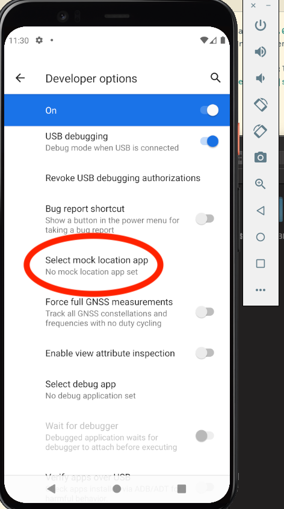
   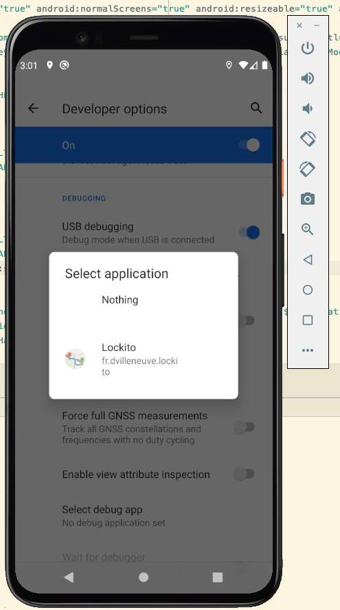

6. Now you have the option to either draw a trip route in Lockito or just import my trip route file. 

   - Get my trip route file here: `documentation/test.gpx`

   - Move the test.gpx file to your phone/emulator. Follow the screenshots below to import the file.
     First, click the import button. 
     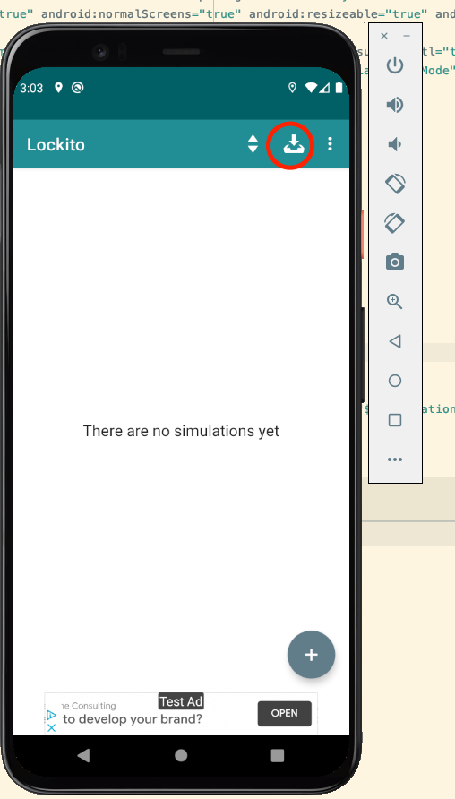

     Then, locate your file. 
     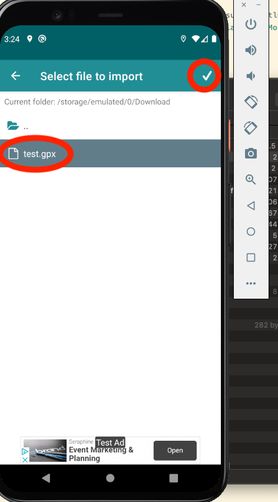

     Finally, click import. 
     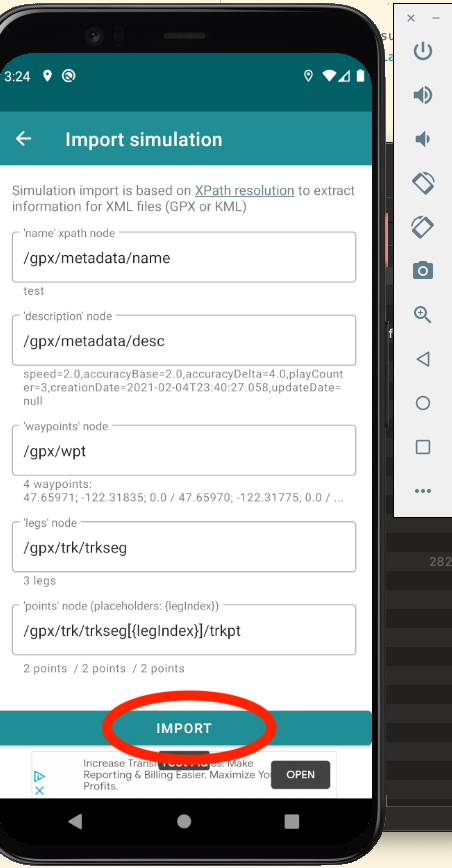

8. Force-trigger a trip in E-mission. Go to the E-mission profiles tab, then click “Developer zone”. 

   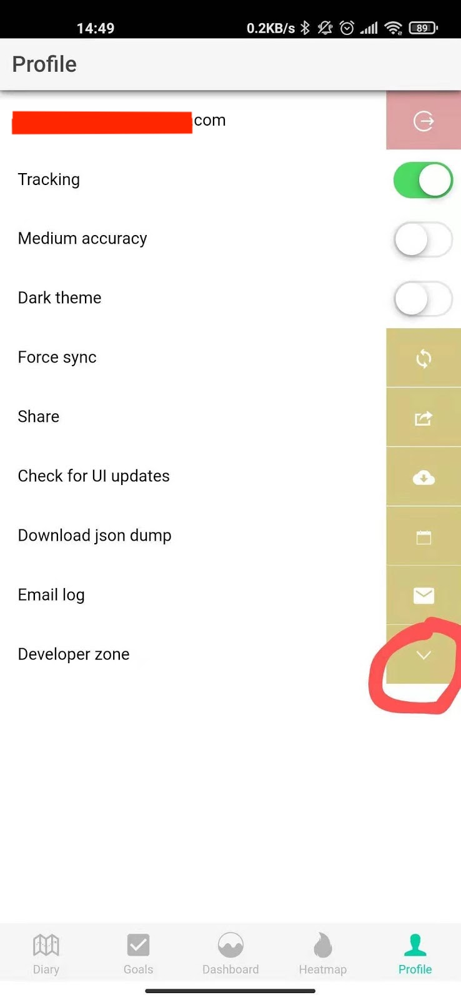
   Then find the waiting_for_trip_start option. Change it to “Start trip”. 
   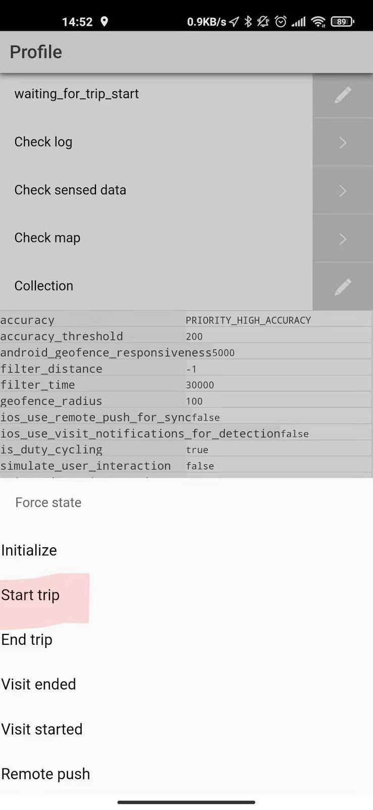

9. Go back to Lockito and find your trip route (whether you imported or drew your own). Click it then click “Play”. 
   
   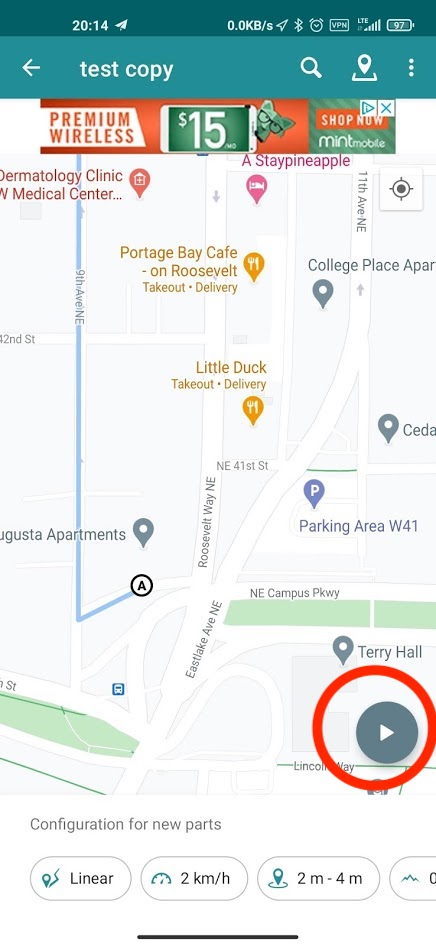

10. Once the pointer stops moving, leave it untouched for roughly 10 seconds. Then click “stop”. 
    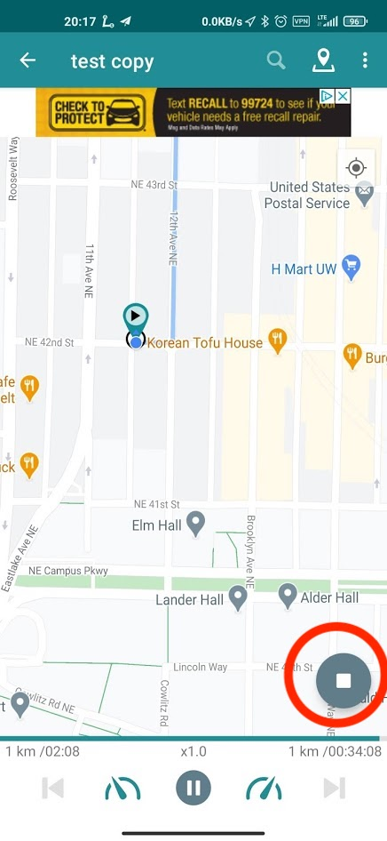
11. Go back to E-mission and “end trip”. 
    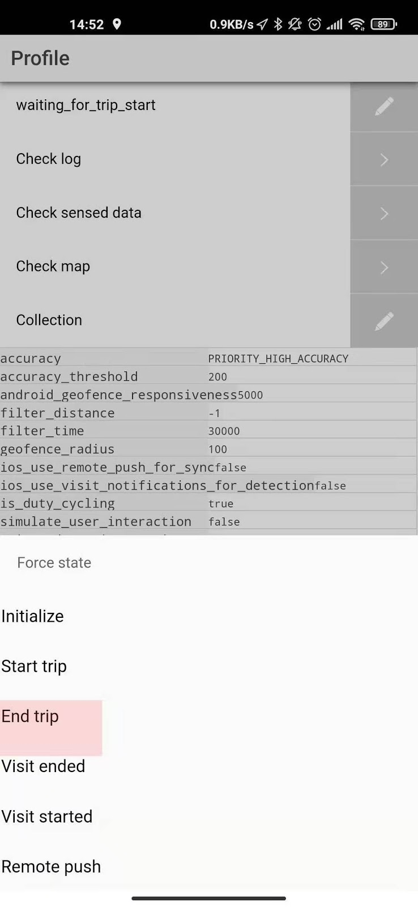
12. Now go to E-mission “Dairy” tab and pull to refresh. You should see a trip diary. 
13. If you see something that looks terribly wrong and unrealistic - time to draw your own route in Lockito that begins & ends with your nearby places!
    - If you use the simulator, use the built-in Location tool to modify the default simulator GPS. This helps E-mission better understand your start location. 
      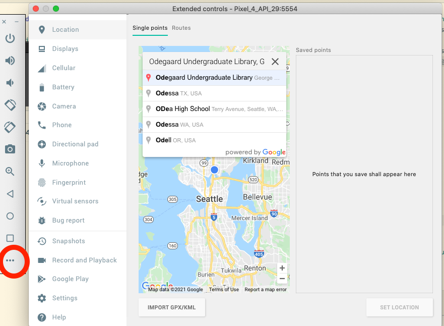