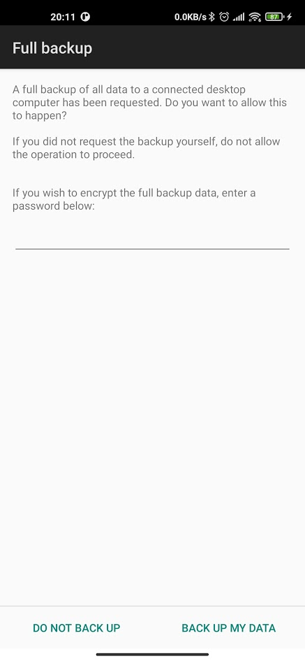

### Obtaining and restoring a full backup of A-mission app

Bowen Xu

This is extremely helpful when the developing team uses multiple phones and the data collection phone is different from the phone used for app development purposes.

#### Backing up

1. Connect your phone to your desktop PC/Mac. Make sure USB debugging is enabled. Then open Android Studio Terminal. Unlock your phone.
2. Run `adb backup -f ~/Downloads/backup_emission.ab edu.berkeley.eecs.emission`
   - Replace `~/Downloads/` with your Windows-style address if you are using a PC.
   - If this step fails in Android Studio, check this for an alternative way to only download and use ADB. Link: https://www.xda-developers.com/install-adb-windows-macos-linux/ 
3. Click “back up my data”. Do not enter any password.
   

4. Send the backup_emission.ab to whoever that's requesting the backup. 

#### Restoring the backup

`adb restore ~/Downloads/backup_emission.ab`

Note that no password is required for the on-screen prompt.

Example data can be found at: https://github.com/xubowenhaoren/A-Mission/raw/main/documentation/backup_emission.ab