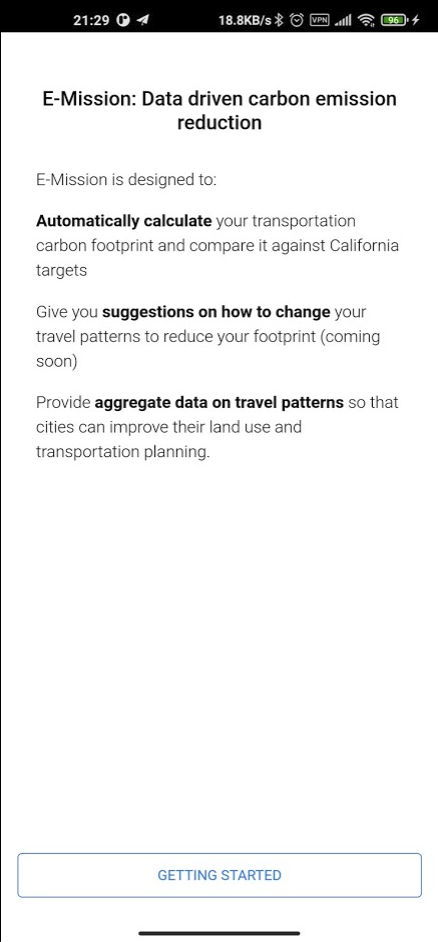
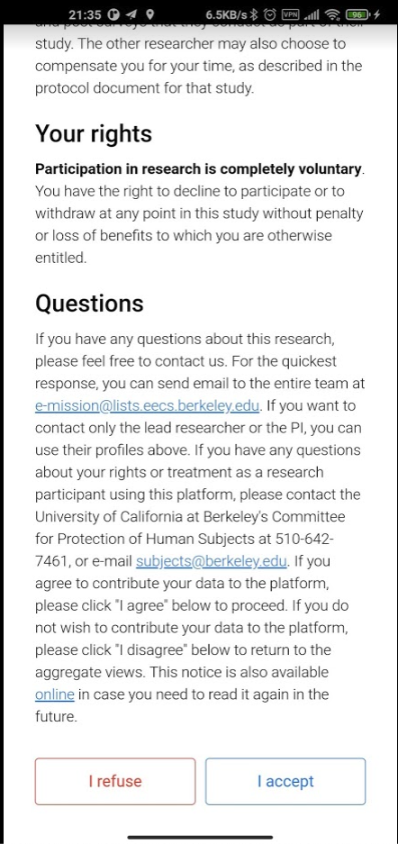
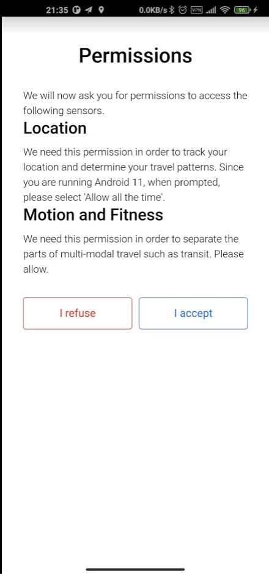
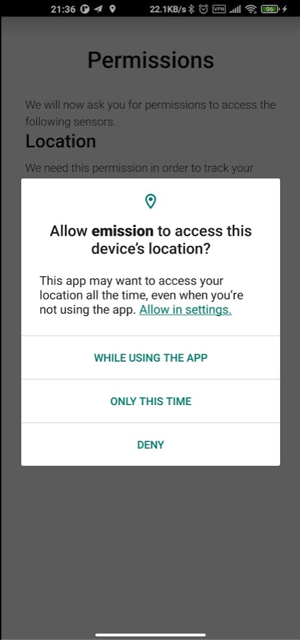
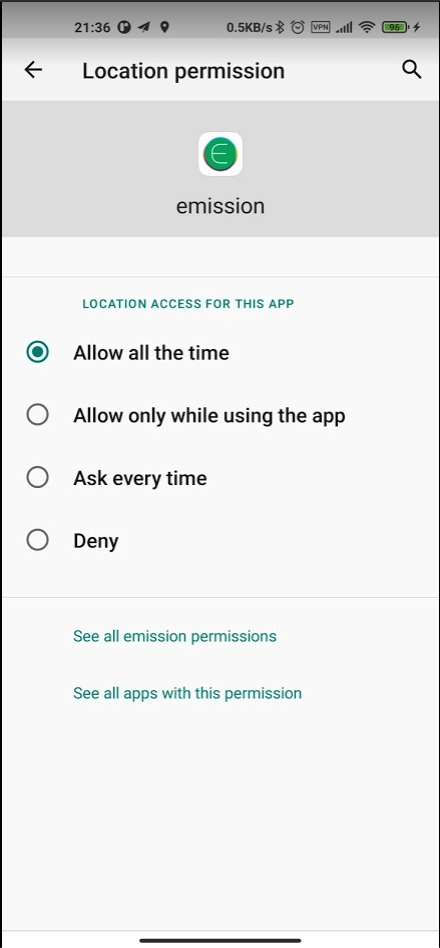
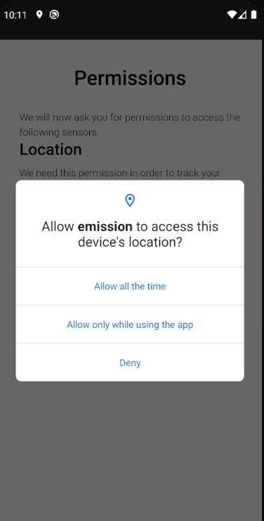
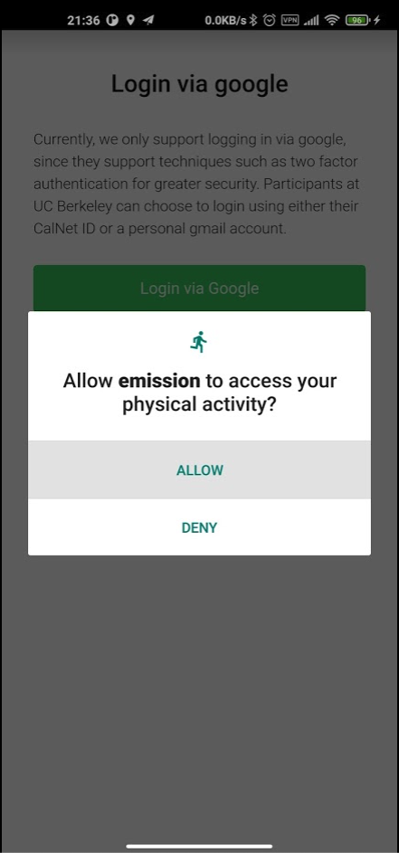
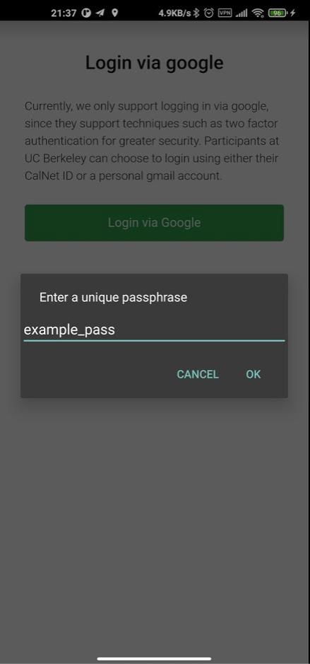
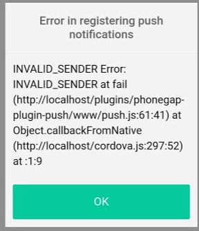

### Registering the App

Bowen Xu

Our priority focus is to make the E-mission trip dairy UI accessible. Thus we didn't have adequate time to make the app registration process fully accessible. 

- Open the app. Then click "GETTING STARTED".
  

- For the user consent page, scroll down and click "I accept".
  

- Permissions: First click "I accept".  You will see a permission popup. 
  

  - If your Android version is 11 or above, click "Allow in settings" -> "Allow all the time".

    
    

  - If your Android version is 10 or below, click "Allow" or "Allow all the time".
    

  - If prompted, also allow E-mission to access your physical activity. 
    

  - Enter a unique passphrase. This can be your email. 

    

  - You may also see the following message. This only indicates that the push notification feature is not currently configured on the server provided by our course staff. This does not indicate any error of our redesigned A-mission UI.
    

  - You should now be able to see the dairy tab. It’s fine to see an empty page (because you didn’t make any trips after installing the app). 
    