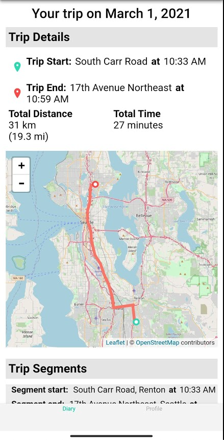
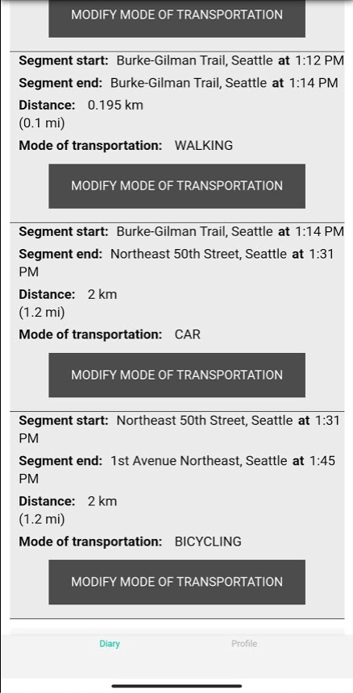
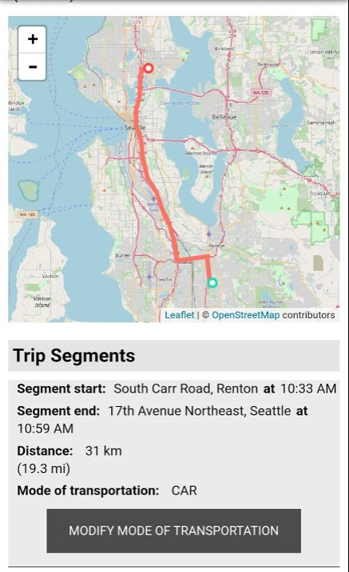
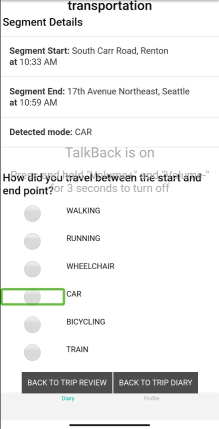

### Viewing Trips and Trip Segments

Bowen Xu

A video demonstrating the overall UI interaction with only the screenreader is at `documentation/demo_video.mp4`. ([link](https://github.com/CSE482Winter2021/NameN0tF0und/raw/main/documentation/demo_video.mp4)) Please start watching at 01:36 for our new A-Mission UI. 

- Note that the app build in the demo still shows "departed from" and "arrived at" for the segmentation start/end places. This has been fixed to "segment start" and "segment end" so we have a consistent language for both trips and segments.

#### Trip Diary UI

- This accessible UI shows summary cards of all trips on a given day. 
  

- Upon opening the app, the trip diary UI loads all trips on the current day.  
- Each trip is represented by a trip card.
  - Each trip card contains the summary information about each trip, including trip start, trip end, total distance, and total time.
  - The trip total distance contains both kilometers and miles. 
- You may use the accesssible previous day/next day buttons to navigate between recent dates. 
  
- You can use the date picker popup window to view trip cards on any date. E-mission is a hybrid app with Javascript, HTML, Ionic, and Angular as the frontend UI. It's rather difficult to refocus the screenreader to the date picker popup. We've consulted the Ionic's accessibility docs and the Angular's `FocusMonitor`, but we weren't able to make the date picker popup fully accessible. 
  

#### Trip Detail UI

- When the user selects "REVIEW TRIP DETAILS" for a trip, this accessible UI displays the relevant trip segment information for that trip.
- “Trip segmentation” refers to the way that E-mission splits up each trip into segments, where each segment involves one single mode of transportation, like walking or riding a bus. A new segment begins when the user switches to a different mode of transportation.
- On the top of the trip detail UI, you find the trip summary again. This helps the user know exactly which trip he/she is reviewing.
  
- On the bottom of the trip detail UI, you can find the "Trip Segment" list showing all segments of the current trip. 
  
- For each segment, the A-mission UI provides the segment start, segment end, segment distance, and the mode of transportation. 
- When the E-mission analysis pipeline believes that there's only one segment in the trip, then this only segment will have the same start/end places, the same start/end times, and the distance statistics as the trip. 
  
- Processed vs unprocessed trips: Both the original E-mission app and our A-mission requires the server-side analysis pipelines to process each trip. The trip processing speed depends on the phone-server connection and the server status. Both factors are beyond the scope and control of our project. Before a trip is processed, the whole trip will appear as one segment and have the "unprocessed" motion mode. 
  

#### Segment motion mode editing UI

- E-mission uses motion inference models to predict the mode of transportation for each trip segment. Since it's a model, it can result in inaccurate predictions. The A-mission UI provides an accessible UI to manually update the motion of transportation. 
  
- The top part of this UI shows the segment start/end places, the segment start/end times. This helps the user know exactly which segment he/she is editing.
- The user can use the radio buttons to update the motion mode. The changes are automatically stored. 
  